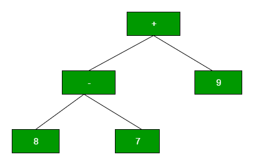
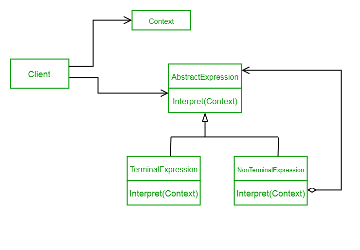

Interpreter design pattern is one of the behavioral design pattern. Interpreter pattern is used to defines a grammatical representation for a language and provides an interpreter to deal with this grammar.

This pattern involves implementing an expression interface which tells to interpret a particular context. This pattern is used in SQL parsing, symbol processing engine etc.
This pattern performs upon a hierarchy of expressions. Each expression here is a terminal or non-terminal.
The tree structure of Interpreter design pattern is somewhat similar to that defined by the composite design pattern with terminal expressions being leaf objects and non-terminal expressions being composites.
The tree contains the expressions to be evaluated and is usually generated by a parser. The parser itself is not a part of the interpreter pattern.
For Example :
Here is the hierarchy of expressions for “+ – 9 8 7” :

Implementing the Interpreter Pattern

UML Diagram Interpreter Design Pattern

Design components

AbstractExpression (Expression): Declares an interpret() operation that all nodes (terminal and nonterminal) in the AST overrides.
TerminalExpression (NumberExpression): Implements the interpret() operation for terminal expressions.
NonterminalExpression (AdditionExpression, SubtractionExpression, and MultiplicationExpression): Implements the interpret() operation for all nonterminal expressions.
Context (String): Contains information that is global to the interpreter. It is this String expression with the Postfix notation that has to be interpreted and parsed.
Client (ExpressionParser): Builds (or is provided) the AST assembled from TerminalExpression and NonTerminalExpression. The Client invokes the interpret() operation.