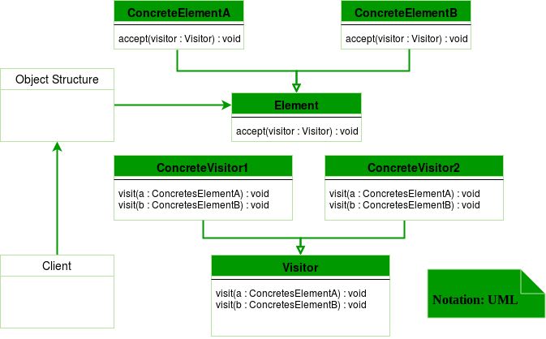

Visitor design pattern is one of the behavioral design patterns. It is used when we have to perform an operation on a group of similar kind of Objects. With the help of visitor pattern, we can move the operational logic from the objects to another class.

The visitor pattern consists of two parts:

a method called Visit() which is implemented by the visitor and is called for every element in the data structure
visitable classes providing Accept() methods that accept a visitor

Advantages :
If the logic of operation changes, then we need to make change only in the visitor implementation rather than doing it in all the item classes.
Adding a new item to the system is easy, it will require change only in visitor interface and implementation and existing item classes will not be affected.

Disadvantages :
We should know the return type of visit() methods at the time of designing otherwise we will have to change the interface and all of its implementations.
If there are too many implementations of visitor interface, it makes it hard to extend.