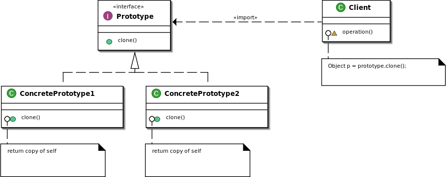

let us take up a design problem to understand command pattern. Suppose you are building a home automation system. There is a programmable remote which can be used to turn on and off various items in your home like lights, stereo, AC etc. It looks something like this.

You can do it with simple if-else statements like

if (buttonPressed == button1)
lights.on()
But we need to keep in mind that turning on some devices like stereo comprises of many steps like setting cd, volume etc. Also we can reassign a button to do something else. By using simple if-else we are coding to implementation rather than interface. Also there is tight coupling.

So what we want to achieve is a design that provides loose coupling and remote control should not have much information about a particular device. The command pattern helps us do that.

Definition: The command pattern encapsulates a request as an object, thereby letting us parameterize other objects with different requests, queue or log requests, and support undoable operations.

