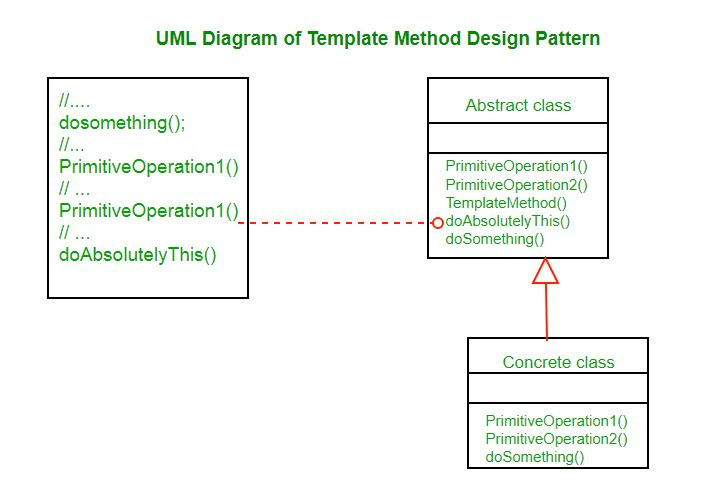

Template method design pattern is to define an algorithm as a skeleton of operations and leave the details to be implemented by the child classes. 
The overall structure and sequence of the algorithm are preserved by the parent class.

It makes it easier to implement complex algorithms by encapsulating logic in a single method.

Template means Preset format like HTML templates which has a fixed preset format. Similarly in the template method pattern, we have a preset structure method called template method which consists of steps. 
These steps can be an abstract method that will be implemented by its subclasses.

avoids duplication in code