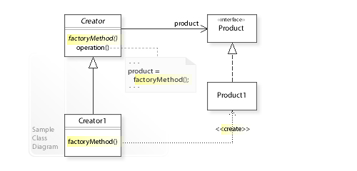

In the Factory pattern, we create objects without exposing the creation logic to the client and the client uses the same common interface to create a new type of object.

The idea is to use a static member-function (static factory method) that creates & returns instances, hiding the details of class modules from the user.
A factory pattern is one of the core design principles to create an object, allowing clients to create objects of a library(explained below) in a way such that it doesn’t have a tight coupling with the class hierarchy of the library.

What is meant when we talk about libraries and clients?
A library is something that is provided by some third party that exposes some public APIs and clients make calls to those public APIs to complete their tasks. A very simple example can be different kinds of Views provided by Android OS. 