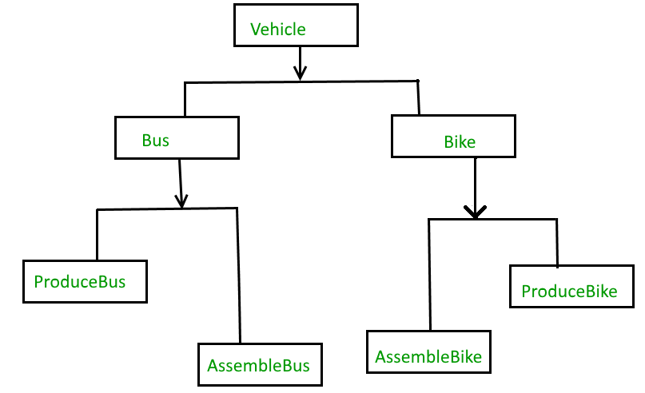
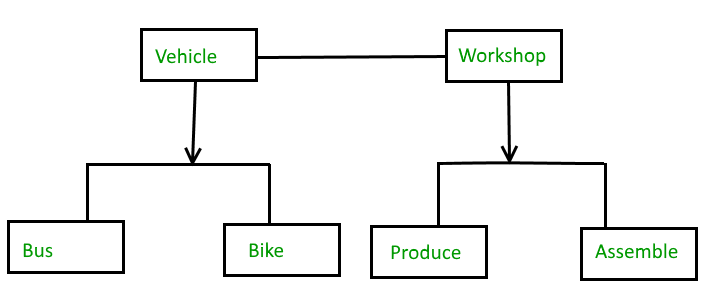

>The Bridge design pattern is allows to the abstraction from its implementation.
1.Abstraction
2.Implementation

>The Bridge pattern allows the Abstraction and its Implementation to be developed independently and the client code can access only the
Abstraction part without being concerned about the implementation part.
>The abstraction is an interface or abstract class and the implementer is also an interface or abstract class.
>The abstraction contains a reference to the implementer. Children of the abstraction are referred to as refined abstractions, and
children of the implementer are concrete implementers. Since we can change the reference to the implementer in the abstraction,
we are able to change the abstraction’s implementer at run-time. Changes to the implementer do not affect client code.
>It increases the loose coupling between class abstraction and it’s implementation.

Elements of Bridge Design Pattern
> Abstraction – core of the bridge design pattern and defines the crux. Contains a reference to the implementer.
> Refined Abstraction – Extends the abstraction takes the finer detail one level below. Hides the finer elements from implemetors.
> Implementer – It defines the interface for implementation classes. This interface does not need to correspond directly to the abstraction interface and can be very different. Abstraction imp provides an implementation in terms of operations provided by the Implementer interface.
> Concrete Implementation – Implements the above implementer by providing the concrete implementation

When we need bridge design pattern

The Bridge pattern is an application of the old advice, “prefer composition over inheritance”. It becomes handy when you must subclass different times in ways that are orthogonal with one another.
For Example, the above example can also be done something like this :

Without Bridge Design Pattern 

But the above solution has a problem. If you want to change the Bus class, then you may end up changing ProduceBus and AssembleBus as well and if the change is workshop specific then you may need to change the Bike class as well.

With Bridge Design Pattern

You can solve the above problem by decoupling the Vehicle and Workshop interfaces in the below manner.

**Advantages**
-> Bridge pattern decouple an abstraction from its implementation so that the two can vary independently.
-> It is used mainly for implementing platform independence features.
-> It adds one more method level redirection to achieve the objective.
-> Publish abstraction interface in a separate inheritance hierarchy, and put the implementation in its own inheritance hierarchy.
-> Use bridge pattern to run-time binding of the implementation.
-> Use bridge pattern to map orthogonal class hierarchies
-> Bridge is designed up-front to let the abstraction and the implementation vary independently.

https://www.baeldung.com/java-bridge-pattern